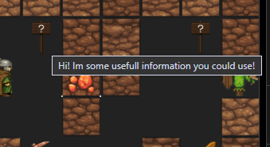
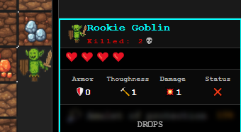
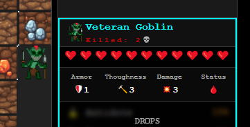
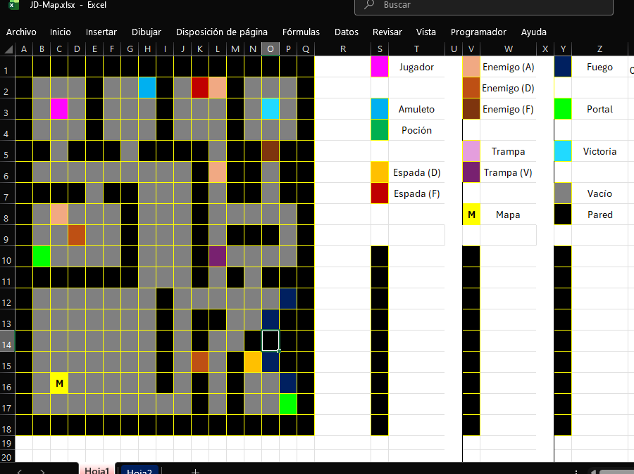
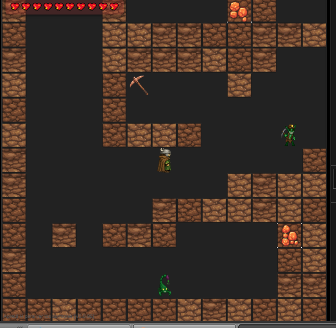
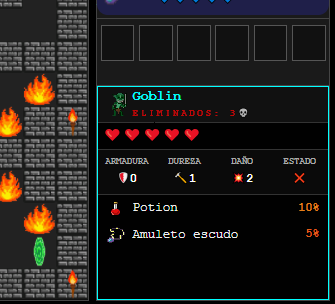
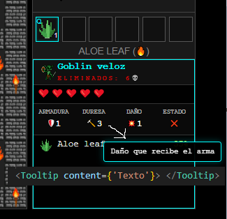
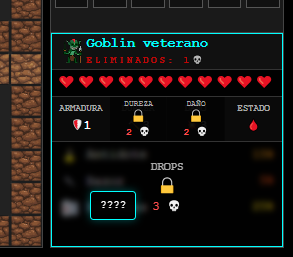
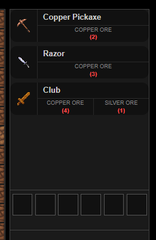
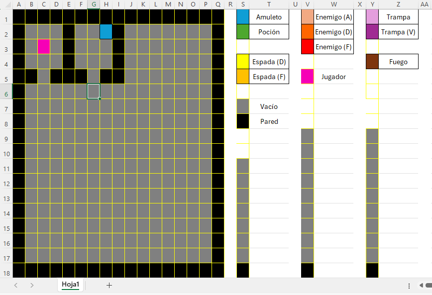

# DevLog - Combat Diary

## 🔹 Step 26: 

🗓️ 2025-08-25

`Tutorial map on the go! This is looking sooo cool... although... I could add this little bit here, that little bit over theeeere... aaaand I'm doing it again, am I not? ☕😅✨`

Dario is deviating from the original plan? Who could have thought!

To be honest, all those little tweaks and perks added WERE necessary and *dramatically* improve the game experience—like... adding those tutorial signs that show some text when you hover over them:



Or the fact that there is an actual KILLABLE mob now—a "tutorial" monster, if you'd like:



Not those absolute UNITS I was placing all over your first steps:



... Where was I again? Oh, yeah, tutorial. ☝👨‍💻✨

I'm... somehow happy with the direction this first map is taking. You've got your fundamentals, a few "figure it out by yourself" moments—combat, weapons, ammo, crafting—all in a *"sorta optional / sorta not"* kind of way.

# Coming right up!

What SHOULD every tutorial have? That's right, a `BOSS`!

Why? 'Cause I say so. 😈

The only problem with that would be, well... creating it. 😅💦

I can't just *use* a regular 1x1 mob with a lot of damage and a bunch of HP. It has to be ***special***.

I'll have to work on some kind of 2x2 entity that works as one—same ID, same patrol pattern... Sounds easy enough, but it'll eat up time that I should be investing in tutorial-friendly stuff. 👾✨

Also, some good floor textures, another visual layer to add a little more personality to this whole game—something without that "early-beta" kind of feel...

# Update mid-update

So—I was thinking about this Boss, right? How to implement it and such—when BOOM—it hit me. **`Arrow velocity`**. ☝😅💦

Yeah, yeah. **I know **I** said **I** had to stick to the plan, but... it was RIGHT **THERE**. One simple change, a couple of lines of code, and the whole "should I use this ammo, or this one?" dilemma becomes relevant. Lovely!

I decided that what I previously decided will wait. ☝🤓✨

# Next update! (this time for real)

Map, tutorial map's last details, and some real game mechanics and intent coming right up.

---

### 🛠️ Technical Changes:

- Added help signs with on-hover text
- Replaced veteran mobs with a more rookie-friendly one
- Added arrow velocity factor, using different ammo has more depth other than damage.

---

### 👾 Near Future / Random Ideas 🎯

Grab what i have and shape up this tutorial map, link it to the next one and let the game flow.

Im not gonna give too much detail 'cause, well, i don't have any 😃❓

Also, once Dario hears an idea- there's no stop to that ADHD hyperfocus... so, let's just let him work-- one goal at a time. 🤏😅💦

---

## 🔹 Step 25: Teleporters Refactored 🌌😮✨

🗓️ 2025-08-18

`On paper, automating map rendering sounds amazing. Now I just need to... fix this right here... refactor that over there... wait, it's actually not that big of a deal ☝🤓✨`

Thanks, past Darío!

Ahhhh... clean, understandable code, robust types, logic you can follow end-to-end. God, I love being able to follow my own breadcrumbs back to the source, understand it, and refactor it *à la carte*. 👩‍🍳🤏✨

But alright, enough self-praise haha. **TL;DR:** Refactored the TP (teleporter) logic.

# In a MEGA nutshell

`Before`, I had to "pre-load" all the maps we were going to use into a list:

[ { map 1 }, { map 2 }, ... ])

And that map *better* be in that list, because if not? 💥

`Now`, the map list starts with only the initial map. After that, as long as the `.csv` file containing the map data physically exists in the `/public/maps` folder, the code dynamically reads the target map's name from the teleporter (i.e., where it’s supposed to take you) and fetches it. Found it? Awesome. It appends it to the map array and renders it on the fly.

Obviously, there's a lot more going on under the hood: caching, TTL cache expiration, pausing/resuming enemy patrols, flags to track whether you've already visited that zone, etc., etc...

But with this up and running and fully tested across a couple of maps—*Eureka!* haha 🌌🎶

---

### 🛠️ Technical Changes:

- Refactored the `swapMap` function:
  - Changed how available maps are tracked and resolved.
  - Added an ID to the cache TTL to prevent edge-case state glitches.
  - Trimmed down the code and added environment flags for production/development.
  - Now we can endlessly add maps and seamlessly travel between them without a hitch.

---

### 👾 Near Future / Random Ideas 🎯

The game has been practically **`BEGGING`** me for a tutorial map for way too long haha 😅💦

**Tutorial Map it is!** The next patch will focus entirely on crafting a proper tutorial level using everything built so far.

...And maybe a few visual tweaks. ☝😅💦

I'm still not 100% sold on the whole *"black floor"*, *"surrounded by the void"*, *"eh, it works, good enough"* look.

Honestly, that was never the original plan... then again, a lot of things here weren't in the initial blueprint 🤓🎶 But I'm riding the wave of this project's organic growth, letting it guide me without dragging me down, just happy to see everything fall into place. *Sort of* (?

---

## 🔹 Step 25: Maps & Scaling 🆕🌎✨

🗓️ 2025-08-12

`It looks great! Now... how the hell do I fill a 24x24 grid without hand-crafting it cell by cell? 😅💦 What if...? ✨😏📃`

For those with a short memory, a few steps back (Step 17, to be precise), I hacked together a prototype of today's solution:

I called it **JS Map Creator!** 🤓✨

It was essentially an Excel spreadsheet with color-coded cells, where each color represented a specific tile type. I think I still have the original screenshot floating around.

Found it!



As you can see... yeah, not super scalable 😅💦 BUT! It totally saved my ass back when I had to manually check every single tile position one by one. It felt like playing Battleship against myself while mapping out levels. 🕹📃

With THAT concept in mind, I asked myself the million-dollar question: *How do I automate this?*

**Behold, the evolution of JS-Map Creator!** 🤓✨:


### Excel + Conditional Formatting.

**`Conditional Formatting`** for quick visual feedback while designing, and **`Excel`** so I can export it as a `.csv` file, rip the raw text, parse it in code into coordinate arrays, and *voilà*! We have an automated map engine. You go into Excel, paint some squares, export it, consume it, and the code goes *"Ahhh, gotcha, gotcha."*

Now, the tricky part... apparently my codebase is way more complex than I remembered 😅💦 What do I mean by that? I have interval timings, patrol pauses, pre-loaded maps, portals, pathfinding, memory & cache storage... I'm doing *SIGNIFICANTLY* more heavy lifting under the hood than I recalled ☝🤓

So right now:
I'm re-reading my own code (which, thank goodness, is pretty well-structured 😅📃), re-understanding the *whys* and *hows*, respecting the architecture, and pushing forward. Currently wiring up the Teleporter integration and map saving state within this new workflow.

Nothing overly miraculous—just good old office-style refactoring: analyzing the flow and adapting it to this new rendering engine. Desk-jockey work 🔎😃✨

---

### 🛠️ Technical Changes:

- Swapped manual grid setup for an automated parser pipeline:
  - Created a utility to convert `.csv` data directly into coordinate arrays.
  - Built a dictionary mapping `.csv` array positions to renderable entities.
  - Implemented `mapReader` to parse the array using the dictionary and trigger rendering.
- Overcame a few hurdles involving duplicate entity IDs, ghost renders, and translation bugs, but everything is smooth sailing now.

---

### 👾 Near Future / Random Ideas 🎯

Everything lined up for the near future is about stabilizing current state.

Once I verify that the new workflow (rendering, maps, TPs, state persistence) is rock solid, *then* I can move forward.

Assuming everything behaves—the absolute, non-negotiable next step is a **TUTORIAL MAP ASAP**. ☝😅💦

---

## 🔹 Step 24: Camera Rework 🎥👀

🗓️ 2025-08-07

`My game looks cool, but... I feel like we could give it way more personality... I KNOW! 😏✨`

I've done a TON since the last log. The thing is, one major architectural change inevitably triggers another, and performance optimization kept me busy enough that I started getting "panic attacks" thinking about writing a massive wall of text to catch up ☝😅💦.

The good news? Here's the **SUMMARY** 🤓✨

The map and the camera:

- The dynamic single-screen setup we had was super clean and stylish. But... managing everything inside a tight 12x12 grid was seriously clipping my wings.

You can't fit much content in there; you can't really "explore" without constantly forcing map transitions.

It felt cheap to give it that "mobile game" or old-school "MapleStory" vibe where taking three steps triggers a loading screen, change map, change map, change map haha. So I thought: *"Where have I seen a game in this style do this right?"* Easy. I've played it a million times ☝😏💡

- `Tibia, RuneScape, ARGENTUM ONLINE` <-- That's where!

Riding the wave of nostalgia from my endless gaming sessions playing Argentum, Tierras del Sur, Tierras Perdidas, and every indie server under the sun, I decided: *"Let's go with a formula that worked brilliantly and put my own personal twist on it."* **Argentum-style.**

I expanded the map dimensions, zoomed the camera in, and locked it to follow the player throughout their adventure.



Boom! Camera updated!

That in itself was a minor nightmare—getting pixel alignment and scaling right. Once freed from the constraints of a 12x12 grid, a new realization hit me: *"Oh man... drawing these massive maps by hand is going to be an absolute NIGHTMARE."* But... I'm already rambling! I'll save that story for the NEXT devlog entry.

---

### 🛠️ Technical Changes:

- Overhauled map rendering architecture:
  - Adjusted cell sizing and scale metrics.
  - Rebuilt tile rendering pipeline.
  - Changed camera behavior (Static viewport ➔ Dynamic player tracking).

---

### 👾 Near Future / Random Ideas 🎯

This entry covers the camera update. In the next one, I'll detail how I'm semi-solving the **MAP** creation nightmare—since larger maps present a massive challenge for manual generation and rendering.

I can't just keep doing `temp[0][0] = empty`, `temp[0][1] = wall`, `temp[0][2] = empty`... I'd lose my damn mind, anyone trying to design a level tomorrow would lose their mind, and scaling would be a complete **NIGHTMARE**.

So, after racking my brain, an idea struck. ☝😏💡

---

## 🔹 Step 23: Equipment Inspector 🔎🎒📖

🗓️ 2025-07-16

`Equipment, weapons, items are getting more complex... I need a more [VISUAL] way to display item stats... I got it ☝🤓✨`

We needed a way to inspect detailed stats for gear, weapons, tools, or anything landing in our primary inventory. But the tight constraints of the `<GearTab.tsx>` component didn't leave much room for creative UI layout 😅✖

While fighting with pixel padding, overlapping text, and the feng-shui of stat numbers, I paused: *"Wait... didn't I already design a fix for a problem just like this?"* 🤔❓

Yup: **`[ InspectorTab.tsx ]`**.

Same concept, different execution. Inspect an item instead of a monster, display base item attributes instead of bestiary stats—reveal hidden data, strip out the kill counter, refactor, tweak, test. 🔧💦

And it worked! IT'S ALIVE!! Now, hovering over any item in the main inventory (`GearTab.tsx`) pops up a clean card with extra context and stats. 🔎📃


It's still work-in-progress, but the core mechanics are solid—layouts line up nicely, and the concept works smoothly. Now it's just a matter of fine-tuning what data to show, in what format, and wrapping up polish. But hey, it makes the game way more intuitive: less "read a manual", more "sit down, hover around, learn on the fly... play." 🎮✨

---

### 🛠️ Technical Changes:

- Added `<GearInspectorTab.tsx>` component.
- Refactored `GearTab` to trigger `GearInspectorTab` `onHover`.
- Implemented conditional rendering for `ranged` vs `melee` weapon stats.
- Pending: Add detailed inspector views for remaining consumable/interactive object types.

---

### 👾 Near Future / Random Ideas 🎯

*Real talk:*
I'm writing this entry a bit late because—without realizing it—I was already knee-deep coding the *next* feature 😅💦 So:

- Pause. Analyze. Document in DevLog. Resume coding.

Right now I'm building a dynamic recipe book, and it's almost fully cooked. What's a dynamic recipe book? Ohhh ☝😏✨

Instead of cluttering the UI with **`ALL`** game recipes at once, we only display recipes you can actually craft based on the materials currently in your inventory. Simple!

Added a nice smooth scroll-down effect, and I'm refactoring the `GearInspector` to preview crafted item stats *before* you commit to crafting them.

Fewer redundant loops, cleaner code, less headache for the overarching game cycle. 😃👾

---

## 🔹 Step 22: Pro-jec-tiles 🏹🤩

🗓️ 2025-07-16

`I have melee weapons, but if I stop there the combat is going to feel way too barebones... I have an idea 😏✨`

We have weapons, equipment crafting, resource gathering... What I needed was a **consumable** item—something required in **large quantities** to give players a meaningful reason to sink raw materials into farming. From that basic gameplay need, the spark ignited:

*`... what if... you have to farm materials to craft ARROWS?`*

BOOM. 

Brain went straight into overdrive. I remembered my older project, Space-Shooter, had a bullet system I could recycle, refactor, and optimize for project entities. Taking that old ***asteroid/laser*** engine as a foundation:

1. Created my first arrow projectile traveling across grid coordinates.
2. Got collision detection working against environment objects (walls, items, `enemies`...).
3. Hooked up status effects, damage calculation, and enemy elimination on impact.

With those three core mechanics functional (if a bit hardcoded), I began optimizing for scalability.

Everything is now decoupled: weapons hold an `ammoType` property, and ammo items hold a matching key. Tomorrow, if we want to add new weapons, it's as clean as:

```
const newWeapon: Types.Gear = {
  ... ,
  slot: 'weapon',         // Weapon item
  style: 'ranged',        // Ranged type
  ammoType: 'bullets',    // Requires matching ammo key
  ...
};
```

```
const newAmmo: Types.Ammo = {
  type: 'Ammo',           // New ammo item
  ammoType: 'bullets',    // Compatible with that weapon class
  attack: { ... },        // Custom damage & status payloads
  ...
};
```

Firearms, **crossbows**, **`weapons firing plasma lasers`**... the architectural groundwork is set. From here on out, the only bottleneck is imagination and balancing time. 👌😏✨

Ranged combat & projectile engines are officially live!

---

### 🛠️ Technical Changes:

- Added a `quiver` state module to store active ammunition types.
- Added crafting recipes for various arrow variants.
- Mapped key `R` to cycle through available compatible ammunition.
- Firing consumes quiver ammo and degrades bow durability.
  - 🏹 Max projectile travel distance scales with equipped ranged weapon stats.
  - 🎯 Durability loss per shot scales with ammo strain.
- Flexible codebase architecture ready for future ranged weapons and custom ammo types.

---

### 👾 Near Future / Random Ideas 🎯

Let's pivot to UI/UX polish: the ranged weapon engine works, but it currently lacks visual feedback 😅 You craft ammo, but it doesn't show up anywhere on the HUD. You can cycle compatible ammo types, but you won't know what's selected until you shoot. Next goals:

- Build dedicated UI indicators for the ammo system.
- Make it clean and self-explanatory so players don't need a manual.

Once players can **see** their active ammo, **understand** how to switch types, and seamlessly **use** ranged weapons... that'll be a massive win for this sprint. ✨😏🏹

---

## 🔹 Step 21: Retiring the Event Log for Something Much Better 😎👌✨

🗓️ 2025-03-14

`I need this game to be more intuitive...` 🤔⏳ `I got it!` 🤩✨

In my quest to make the game "pick up and play" without forcing players to read a massive manual, I tried adding help slide overlays (triggered with `'H'`). I also tried using the text event log (`<ConsoleTab/>`) to report ground loots, incoming damage types, and status ticks—all attempts to make the game world feel readable and intuitive.

***Hard pivot*** 🛑✋

Scrapped the event console entirely and replaced it with clean visual UI feedback:

**`[InspectorTab]`**
Clicking any map entity brings up a contextual inspector card with stats and info.



**`[ToolTip]`** Hovering over tiles or UI elements displays quick descriptive text. Zero guessing!



**`[Unlockables]`** Information isn't fully handed to you on a silver platter. You have to kill $X$ amount of a specific creature type to progressively unlock full bestiary entries and drop tables.



Fleshing out the inspection panel was super fun to build: Gaussian blur effects over locked entries, color-coded rarity percentages for item drop rates, writing clear descriptions for mechanics like "Armor" and "Toughness"... awesome dev journey. 😃✨

Oh! I also added extra granularity to enemy patrol logic—I can now assign custom movement tick speeds to individual entities. 😁

That's why a speedy Goblin moves fast despite being fragile, while a Goblin Veteran plods along slowly but hits like a runaway freight train (+ bleed stacks).

It breathes so much life into the world. Explore, hunt creatures, farm them to uncover their drop tables, memorize high-value spawn routes, gather crafting reagents or consumables. Pure dungeon crawler adventure energy! 🐱‍🐉🔥🎉

---

### 🛠️ Technical Changes:

- Added `<InspectorTab/>`, `<ToolTip/>`, and `<StatCell/>` components for enhanced visual feedback.
- Configured visual styling for locked entries, integrated bestiary kill trackers, and decoupled component interactions.
- Locked mouse focus inside the primary map viewport container to prevent accidental defocusing during gameplay input.

---

### 👾 Near Future / Random Ideas 🎯

The game is intuitive, crafting works, mob drop farming is live... hmm...

I could go crazy adding endless content: spells, ranged options, advanced AI pathfinding, **Boss fights**, unique mob abilities—PHEW...

But being **objective**: now that I have a rock-solid, fully playable game core with all pieces on the board... it's time to build a cohesive experience around it. ☝😅✨

Next patch goals:

- Rebalance weapon stats, trinkets, and amulets.
- Rebalance mob drop rates and roll percentages.
- Map design and level expansion.
- ...I said I wouldn't add new features, but... 👉👈

I'm dying to build an equipment upgrade system... 🤤✨

[ Mace ] ➔ [ Mace +1 ] ➔ [ Mace +2 ] ➔ [ Mace ⭐ ]

Gems, catalysts, scaling failure chances at higher tiers—a simple risk/reward loop to give players a real reason to farm rare materials ⭐✨

First: balancing. Then: new maps. *Then*, gear upgrading experiments. One step at a time, keeping everything in harmony with the rest of the game systems.

---

## 🔹 Step 20: CRAFTING! 💥🔨

`Okay, I have all these ores... Now what?` 🤔❔ `CRAFTING!` 🤩✨

This was one of the features I was most hyped to build! I originally thought about writing a technical deep-dive on the underlying state management, but that's dry and boring for a log. So here's the fun summary: 👓📖

I created a secondary `GearTab` (equipment inventory), set up `TAB` to toggle seamlessly between both views, and updated keybindings so inputs route cleanly to whichever tab is currently focused. 🏹🔁🔨

Recipes read your current inventory, evaluate reagent quantities, and highlight what you can craft. Pressing `E` (previously used exclusively for equip/unequip actions) now crafts your currently selected recipe. 🔪✅

Material validation and deduction, item output dispatching, and immediate UI updates to show remaining craftable recipes—all fully functional! ✨🔨



---

### 🛠️ Technical Changes:

`<CraftingTab>`

**Parses recipe arrays and renders available crafting options.**

Currently: **Static recipe registry**.
Future hooks are ready for expanded crafting interactions:

➔ Learnable recipe scrolls/schematics.

➔ Consumable single-use recipes.

➔ Class-specific, stat-locked, or level-gated recipes... 🤤✨

*...okay, that last part was wild feature speculation, not technical changes* 😅💦

- **Added** dedicated recipe rendering views.
- **Implemented** ingredient validation utilities, material consumption handlers, and item yield dispatchers.
- Sounds simple on paper, but engineering everything to scale cleanly takes serious dev time 🤓✨

---

### 👾 Near Future / Random Ideas 🎯

Standing where I am now, everything makes sense. I know my codebase inside out, I know what to touch and where... but I need to make the user experience even **more intuitive**.

Next step: add clearer visual cues, easily readable stat breakdowns, and a friendly UI that invites players to "click around, experiment, break stuff, learn by doing." 👾🔥

---

## 🔹 Step 19: Necessary Patches 🚑👩‍💻

🗓️ 2025-01-20

`What do you mean the playable demo is broken?!` 👀

**Summary:** Refactored a large portion of the core codebase, cleared out all ESLint warnings, and fixed environment flags differentiating local dev from production builds. The online demo is fully operational again: mining, combat, gear equipping, DoTs—all 100% functional.

Live Demo Link: https://js-dungeon.vercel.app/ 👾✨

Took the opportunity to tweak min/max sizing constraints across the event log, gear tab, and consumables panel. Added explicit item names and hint tooltips so items explain themselves.

---

### 🛠️ Technical Changes:

- Refactored build flags for seamless environment detection between `localhost` and `Vercel` deployments.
- Cleaned up and resolved all ESLint warnings across the project.
- Added keybinding support to drop/discard consumables with `Backspace`.
- Enforced `max-height` constraints on `<ConsoleTab/>`, `<GearTab/>`, and `<ConsumablesTab/>` for clean UI alignment.

---

### 👾 Near Future / Random Ideas 🎯

I constantly run into optimization passes midway through my original goals 😅✨

Now that everything is stable (antidotes, mining, combat, healing, loot tables...), I can:

- Give actual utility to mined ores.
- Add new map layouts.
- Introduce interactive world items. <--

--> Specifically, I've been thinking about adding a consumable **Bomb** item 💣. Classic *Bomberman* style: drop it behind you, short fuse, then BOOM. Sounds hilarious to build, and opens up cool tactical rules like:

**`[Pushable]`** Kick bombs around the grid (giving boxes a real gameplay purpose!).

**`[Contact Detonation]`** Explode on contact with patrolling enemies to interrupt paths or setup ambushes... 🤤✨

**`[Elemental Bomb Variants]`** Freeze bombs, poison gas bombs, incendiary bombs...

---

## 🔹 Step 18: Visual Coherence & UX Polish 🌈👾

🗓️ 2025-01-11

`Design, color palettes, spacing, and visual crispness.` ✨

**Happy New Year!** 🥳🎉

Now that I have a "playable game" (slashing mobs, looting gear, farming resources...), my main focus is transforming it into an **"INTUITIVE game."**

I want players to sit down, explore, and naturally figure out mechanics without needing pop-up walls of text, tedious tutorials, or immersion-breaking guides.

With that in mind, I gave the `<GearTab/>` a major visual makeover:
- Render actual item icons directly on gear slots.
- Color-coded borders to quickly differentiate equipment types.
- Visual cooldown animations for actions/swaps.
- Clear durability status bars (like health bars for gear).

<p align="center">
  
  <br />
  <em>New equipment UI visuals.</em>
</p>

---

### 🛠️ Technical Changes:

Focused purely on visual upgrades and UX clarity—no core logic breaks:

- **`GearTab.module.css`**: Converted legacy CSS into scoped CSS Modules to prevent style leaks as the application scales.
- **New Icons & Enemy**: Added fresh sprite icons (like ore graphics) and introduced a new mob type: the *Goblin Miner*. Makes way more sense for a miner mob to drop a copper pickaxe instead of a regular warrior goblin dropping mining tools!
- **`DurabilityBar.tsx`**: Replaced numeric `10/10` text with a visual health-bar-style durability indicator for instant readability.

---

### 👾 Near Future / Random Ideas 🎯

I need to clean up my old inventory UI layout—currently, pressing `I` pops open a full panel originally intended for crafting, with items awkwardly squished at the bottom.

- Move inventory items to a persistent, clean hotbar along the bottom of the screen.
- **CRAFTING!!** Implement crafting systems and put mined ores to good use.
- Maybe introduce a simple gem/socket upgrade system for equipment down the line.

---

## 🔹 Step 17: Redefining the Foundation

🗓️ 2025-12-26

`Deep debugging, deep re-thinking.`

I completely rebuilt the core architectural logic with one single priority in mind: **Scalability**. I sacrificed short-term feature progress for long-term stability—a tedious detour, but an absolute necessity.

**Surprise!** *[to myself]*

While restructuring the foundation, it hit me: I didn't need a complex, bloatware "map engine"... I just needed a fast, practical tool.

Behold **JS Map Creator**! 🤓✨

Excel, perfectly square grid cells, an 18x18 layout, color legends on the side, and complete freedom to experiment with map designs without wrestling with React state. Rustic, raw, and absurdly effective.

<p align="center">
  
  <br />
  <em>JS Map Creator (Excel-based, 18×18 grid)</em>
</p>

I can quickly draft level layouts in Excel and parse them row-by-row into grid coordinates.

As a solo dev, I just needed an efficient, low-friction solution. Excel provided the exact toolset required—my parser handles the rest. 🎶

---

### 🛠️ Technical Changes:

- Matrix data structures refactored: every row entry now represents a complete entity instance rather than isolated ASCII symbols or raw strings.
- Patrol intervals decoupled: individual enemy patrol loops are tracked independently, allowing clean `clearInterval(id)` teardowns without unintended side effects or movement glitches.
- Fixed a bug where DoT (Damage over Time) tick deaths caused state desyncs.

---

### 👾 Near Future / Random Ideas 🎯

If everything stays on track and I maintain focus, the next patch should wrap into a **legitimate, playable demo** with clear objectives and solid core gameplay loops.

...I'm itching to build ranged weapons... **spells... AREA OF EFFECT ATTACKS!**. But no! Focus—focus—**FOCUS!** We're on the right track! 👾✨

---

## 🔹 Step 16: Demo Live on Vercel! 🙂🚀✨

🗓️ 2025-05-26

`First major milestone.`

*JS-Dungeon* isn't finished, nor is it going in the exact direction I originally envisioned—and that's totally fine. My initial idea evolved, and instead of forcing a rigid vision, I'm letting the best gameplay ideas guide the project.

Hitting React's performance ceiling with complex visual layering made me realize I shouldn't try to build a bloated graphical engine here. Instead, I'm going to squeeze every bit of power out of React for what it *does* best. 🔥🔨⚙

There are still a few missing help slides (explaining status effects like DoT, bleed, poison, burn, accessory usage, and cleansing), but I shouldn't keep holding back deployment out of imposter syndrome. This project represents the peak of my current dev capabilities, and I'm having a blast building it.

---

### 🛠️ Technical Changes:

- **DOCS**: Updated `README.md` with direct deployment links to the live Vercel showcase.
- **UI**: Added a visible HUD prompt: *"Press H for Tutorial"*.
- **Slides**: Added a final tutorial slide featuring a direct link button back to the GitHub repository.

---

### 👾 Near Future / Random Ideas 🎯

- Full steam ahead—now running live and deployed on Vercel! 🚀✨

---

## 🔹 Step 15: "Press H for HUH?!" Help Slides! 👌🧐✨

🗓️ 2025-05-26

I'm wrapping up UI concepts, polishing core flows, and preparing to host the game online for anyone to play. That got me thinking: *What feels cryptic? What would confuse a player jumping in with zero context?*

With a critical eye, I built an overlay **help slide system**: pressing key `'H'` opens a clean carousel breaking down core mechanics `(HUD, Gear, Controls, etc.)`. To build it:
- Sourced, cropped, and cleaned up background transparency for every sprite icon.
- Hand-designed custom guide slides (250x350px) with consistent typography, iconography, and color palettes.
- Organized assets neatly inside an `Images/` directory backed by a central `index.ts` export module for clean imports.

I also added a dedicated **Game Over Screen** (triggered when player HP drops to 0) and reworked hotbar navigation inputs—switching from ←→ to ↑↓ arrow keys to match the vertical hotbar layout.

---

### 🛠️ Technical Changes:

- **Hotbar**: Rebound hotbar cycling from horizontal (←→) to vertical (↑↓) key events, aligning controls with visual UI orientation.
- **Help Slides Engine**:
  - Implemented toggle state handlers bound to the `'H'` key event.
  - Built typed interfaces to manage slide deck state.
  - Assets custom-designed and modularly exported.

---

### 👾 Near Future / Random Ideas 🎯

- Display target mob information on hover (HP bar, attack power, defense stats).
- Display stat comparison tooltips on gear hover.
- Design structured level maps with actual objectives: right now the game is a fun *feature sandbox*. I want to take this toolset and build **a polished, complete gameplay loop**. 🎊✨

---

## 🔹 Step 14: Massive Visual Overhaul & Modularization 💻🤓🔧

🗓️ 2025-05-24

**`MODULARIZATION!`**

I originally kept modularization in my back pocket as a late-stage polish phase, but migrating away from a single +2K line monolith file became inevitable. Navigating thousands of lines of cluttered code just to tweak an interface or update an icon was a nightmare. Time for a refactoring revolution! 💥

Decoupled core files into dedicated modules: `types & interfaces`, `entities`, `items`, `gear`, and `icons`. Everything cleanly imported/exported. *Che bellezza!* 🤏

Since the goal is a sleek playable demo, visual HUD clutter was bugging me. This patch focused heavily on fixing layout structure, establishing visual hierarchy, and polishing overall UX/UI.

Fixed dimensions, absolute positioning cleanup, padding, typography scale, gear card layouts, console event formatting, player state bindings... everything needed to transform abstract ASCII visuals into an intuitive, readable game interface.

Furthermore, Damage Over Time (DoT) ticks on enemies now render floating combat text numbers. GearCards are far more explicit, items display keybinding shortcuts, and dozens of minor details now make the game feel *presentable*... *playable*. ✨

---

### 🛠️ Technical Changes:

- Removed redundant CSS overflow scrollbars and established fixed, responsive dimensional constraints to keep UI modules cleanly docked.
- Refactored core dispatchers (`setPlayer`, `setEnemies`, etc.) to batch state updates and eliminate redundant re-renders.
- Polish pass: visible enemy damage indicators, improved status effect typography, explicit hotkey indicators on item slots (`Item.hotkey: string`), and cleaner layout alignment.

---

### 👾 Near Future / Random Ideas 🎯

The project is officially *presentable*. The next milestone is locking down a simple, fun gameplay loop without bloating the codebase with overly complex systems.

- Hold off on heavy new mechanics (like dynamic AI pathfinding) that could bottleneck a React-driven DOM engine.
- Replace current static enemies with target practice dummies to maintain thematic consistency since they don't roam yet.
- Continue modularizing utility logic into custom hooks to keep components lean and maintainable.

---

🎮 *JS-Dungeon is getting closer to a rock-solid, fully playable demo backed by clean technical foundations.* 👨‍💻✨

---

## 🔹 Step 13: Amulets & A Visual Speedbump 📿🧐/😨💻

🗓️ 2025-05-20

So... I ran into a minor reality check 😅 I tend to get super excited, brainstorming wild future mechanics and writing **highly scalable code**—making sure every new module is built to hook into complex game loops down the road! 🤪🎉

**The catch: `REACT`** 🥶💻💥

Deep in full-stack dev mode, typing away at what I love, I momentarily forgot that I was essentially building a custom game engine inside DOM nodes—far exceeding what React is optimized to render efficiently. 😅 Oops!

React isn't designed to handle endless re-renders, concurrent ticker states, dynamic collision flags, and complex multi-layer animations running simultaneously.

As Howard Stark would put it: *"I'm limited by the technology of my time..."* 😁

`Message received!`: I'm pausing massive new system implementations to focus on polishing a compact, highly responsive demo. Maybe I'll split future ideas into standalone minigames (a dedicated farming loop, a turn-based combat module, a trading sim). I'm logging these ideas for future standalone builds, but my immediate focus is shipping a clean, complete demo. ✨

---

### 🛠️ Technical Changes:

- Hit a performance bottleneck! Built two dedicated visual overlay layers (complete with state logic) to render floating text and particle effects for damage and healing.

`BUT`... during stress testing? 💥🔥💥🔥💥

Frame drops and state desyncs galore. After profiling and debugging, the bottleneck was clear: running heavy animation ticks directly through React DOM renders wasn't performant. Rolled back the overlay layers and restructured the rendering flow for smooth 60fps execution.

- **Amulets System Live!**
  - Added `damageCharm()` state logic to handle trinket durability and damage mitigation.
  - Refactored `hurtPlayer()` to process active warding calculations.
  - Added `necklaceImg` assets and integrated protective amulets into gear slots.

---

### 👾 Near Future / Random Ideas 🎯

Now that I'm fully aware of engine limits:

- Scope down and polish a fun, responsive core loop using current tools.
- Focus on showcasing *one* complete gameplay arc: Weapons, Status Effects, Items, or Spells.
- Streamline existing architecture and trim unnecessary rendering overhead.

---

## 🔹 Step 12: Goodbye ASCII! Hello Readable World ✨😎🤙

🗓️ 2025-05-15

While working on core mechanics, refactoring loops, and building entity handlers, I caught myself asking:

*"How should I represent this new item?.. With a `'q'`? A `'#'`? A...? Wait... why am I still using `ASCII`?"*

I can't move forward knowing something in the project feels outdated. Band-aiding new features with raw ASCII characters was just creating tech debt for future-me haha. So: **Visual Overhaul time!**

Now, anyone opening the demo gets an **instant, intuitive understanding** of what's happening on screen. That's a massive leap forward! I can showcase the project without having to act like a narrator explaining what every letter represents. 🤣👌

---

### 🛠️ Technical Changes:

- **Secondary Overlay Map Engine**: Built `setVisuals` to handle secondary animations, buffs, damage numbers, and attack highlights.
- **Icons, Refactoring & Event Handlers**: Added coordinate-based visual effect handlers for player/world interactions, integrated PNG sprite assets (with full TypeScript typings), and refactored underlying map state engines to support asset rendering (`String` ➔ `Sprite`).

---

### 👾 Near Future / Random Ideas 🎯

(Obviously I didn't follow all the random ideas from last patch **hahaha**)

- Now that the visual makeover is done, I can jump back into CORE mechanics planned earlier:
➔ Selectable Hotbar navigation.
➔ Expanded equipment items.
➔ Amulets, Stat Boosters, Traps? //Experimenting\\

---

## 🔹 Step 11: Equipables, HotBar & Durability 🗡💥✨

🗓️ 2025-05-14

Durability! Equipable gear! Classic, essential RPG mechanics. Players can now **equip** weapons found while exploring, dynamically updating combat stats on hit (Direct Damage & DoT payloads).

Enemies feature varying **Toughness** ratings, translating directly to durability wear-and-tear on equipped weapons. Once durability hits **zero**, the weapon **`BREAKS`**. None of that "repair it at 0 HP" nonsense—**Zero = PERMANENT LOSS** 😈.

Weapons apply *status effects* on enemies (Poison, Bleed, Burn) matching player debuff logic. I plan to introduce mob resistances and immunities in upcoming passes, prioritizing a rock-solid foundation first before adding complex resistance matrices (% chance based on mob armor class, 0% on immune targets).

Players get immediate visual feedback in the event log when striking enemies, inflicting debuffs, or scoring kills. Color-coded log messages, anti-flicker guards, and async React state race condition fixes were implemented to guarantee rock-solid code.

---

### 🛠️ Technical Changes:

- **Refactoring Pass**: Standardized `damageEnemy()`, `enemyDeath()`, `manageDotInstance()`, and `cleanse()` to share a single unified DoT, cleanse, and kill engine.
- **Bug Squashing**: Re-engineered `manageDotInstance()` and `finishDoT()` to consume fresh state references on every tick execution, eliminating stale closure bugs during fast-paced inputs.

---

### 👾 Near Future / Random Ideas 🎯

- With enemy DoTs operational, next comes **resistances**, **immunities**... maybe even **AoE attacks**? 💥🔥😱
- Make status applications context-aware: if weapon damage fails to penetrate mob armor (Mob Armor 1, Weapon Damage 1 ➔ Net Damage 0), it makes no sense for the target to suffer **bleed** or **poison**. No physical contact = no blood! Haha. If net damage $\ge 1$, status application rolls make sense. Elemental effects like **Burn**, on the other hand, could bypass physical armor entirely. Fun edge cases to tune! ✨🐱‍💻✨
- Rework equipment swapping mechanics: instead of instant hotbar swaps, let players **navigate** through equipped hotbar slots, highlight their desired item, and press an action key to activate/equip (Monster Hunter style menu navigation).

🗡  - 🔪  - `(🪒)`

🗡  - `(🔪)`  - 🪒

`(🗡)`  - 🔪  - 🪒

- Once selectable hotbar navigation is working, introduce new **Gear categories**: Amulets, Shields, temporary damage boosters—so many cool possibilities thanks to scalable architecture. ✨🐱‍💻💕

---

## 🔹 Step 10: Gathering & Mob Drop Systems Live 🌾🪓🧱

🗓️ 2025-05-07

This patch introduces the initial version of our gathering and loot drop system. Enemies drop items on death, and this exact logic is generalized across all interactive world entities.

Any destructible map tile—mineral veins, trees, doors, crates, bridges, hidden walls—triggers item drops upon destruction. This unified structure makes expanding gathering and exploration mechanics effortless.

Dynamic enemy movement and patrol AI have been temporarily deferred until the playable prototype reaches a higher state of visual polish.

---

### 🛠️ Technical Changes:

- **`finishBuff()`**: Teardown handler for active player buffs, cleanly wiping associated tick intervals (HoT, stat buffs, shield timers).
- **`handleInteraction()`**: Contextual interaction dispatcher. Pressing `[ENTER]` triggers actions on the entity directly facing the player.
- **`damageEnemy()`**: Processes target coordinates and raw damage values. Calculates net damage against defense/shield values and executes `dropTable` rolls on death.
- **Typed Data Interfaces**: Defined explicit structures for enemies, traps, and items. Reading any coordinate tile returns a fully typed entity object (stats, behaviors, properties), streamlining map interactions.

---

### 👾 Near Future / Random Ideas 🎯

- Gear implementation: Right now, pressing `[ENTER]` strikes whatever is in front of the player for 2 base damage. Why 2 damage? Is the player punching rocks with bare fists? Easy fix: add weapons with attack stats, durability ratings, and status payloads.
- Status payloads on weapons open up debuff logic on enemies (poison, burn, bleed).
- Durability loss on weapons—hitting zero completely destroys the item (no lingering at 0/100).
- Which *(hehehe)* leads to another idea: weapon upgrades (+1, +2, gem sockets, enchantments)... so many fun mechanics to consider!

---

## 🔹 Step 9: Core Refactoring, Centralization & Code Cleanliness ☝🤓✨

🗓️ 2025-04-30

Refactored a MAJOR portion of the project's `CORE` state logic. There were far too many isolated local states attempting to modify player properties independently. It was practically screaming *"REFACTOR ME PLEASE"* from every module. Request granted!

Residual tiles, DoT status ticks, inventory state, trigger flags—**EVERYTHING** was refactored line by line, like taking apart a mechanical clock to see why it ticks... and rebuilding it to run even smoother. It was a great exercise, and now I can expand systems without tripping over a tangled web of independent local states.

Resisted the temptation to feature-creep midway through refactoring! Kept laser-focused on the primary goal of this sprint: clean, scalable state architecture centered around a unified `Player` state object (`.Aliments`, `.HP`, `.HpMax`, `.Data`, etc.).

---

### 🛠️ Technical Details:

- Refactored `residual()` tile mechanics to queue multiple overlapping map symbols awaiting respawn/restore timers.
- Overhauled `DoT` tick engines and `cleanse()` handlers to integrate cleanly into the unified Player state.
- Centralized inventory arrays, HP pools, and coordinate tracking under a single, predictable state object.

---

### 👾 Near Future / Random Ideas 🎯

- Need to build a heal-reduction / anti-heal debuff mechanic ASAP! 😂✨
- Roaming enemy patrol loops.
- Enemy collision damage handlers.
- Enemy health tracking and death dispatchers.

If time permits:

- Player attack actions.
- Drop rate mechanics [Alpha stage].

---

## 🔹 Step 8: Inventory Foundations, Item Consumption & Loot Pickup 🎁💰✨

🗓️ 2025-04-26

Previous milestones always lay out a clear roadmap for what comes next. Having built Healing and Status Cleanse systems, the next logical step was giving players strategic access to these resources: **inventory management and hotkeys**. 💰✨

Players can now find item pickups dropped across map tiles, automatically gathering and stacking them into available inventory slots upon stepping over them. Consumables feature stack management and action cooldowns to prevent spamming items mid-combat (no infinite instant-healing allowed! 😄).

Refactored all relevant handlers to guarantee long-term stability and scalability. The world can hurt us, and now we have the tools to fight back: resource management, material farming, loot drops... endless new gameplay doors unlocked!

---

### 🛠️ Technical Details:

Key technical implementations include:

- `stepOnItem()`: Evaluates inventory capacity and invokes `addToInventory()` on valid pickup events.
- `addToInventory()`: Manages slot allocation, stack thresholds, and item counts.
- `consumeItem()`: Validates item requirements, dispatches consumable effects, and triggers global action cooldowns.
- Integrated global **Action Cooldown** state logic.
- Applied explicit TypeScript types across item entities and helper functions.
- Implemented quick-use hotkeys for inventory items.

---

### 👾 Near Future / Random Ideas 🎯

Before piling on new systems, I'm prioritizing a **deep refactoring sprint**. Even though I'd love to push new features non-stop, acting as my own Team Lead means ensuring the codebase remains rock-solid, readable, and scalable.

Post-refactoring priorities:

- Roaming enemy patrol paths with environmental collision detection.
- Interaction handling between roaming mobs, players, grid obstacles, and world entities.
- Implement variable **Drop Rates** for loot farming.

---

## 🔹 Step 7: Cleanse, Healing & Totems
_🩺 Support & Recovery! 💉_

🗓️ 2025-04-25

Having implemented Damage over Time (DoT) last patch, the most balanced way to close the loop was building its direct counter: direct healing, status cleanses, and Healing over Time (**HoT**).

Direct `healing` and **HoT** ticks were straightforward—refactored the damage calculator (`hurtPlayer`) to increment health pools instead of reducing them, applying the inverse logic for HoT ticks.

`cleanse()` logic was a far more interesting puzzle. Tracking, applying, and cleanly canceling pending damage instances required rethinking state storage. Love a good logic challenge!

Now the game world has balance: harm and heal, infect and cleanse—allowing players to take calculated risks knowing they have strategic countermeasures. Depth! Tools for tomorrow.

---

### 🛠️ Technical Details:

- Created `cleanse()`: Accepts specific debuff types (or purges all active debuffs), instantly clearing pending damage queue ticks.
- Refactored `useEffect` dependencies and action dispatchers to support instant status clearing.
- Introduced map 'Totems' and quick-cleansing hotkeys.

---

### 👾 Near Future / Random Ideas 🎯

Now that Healing and Cleansing exist, I need ways to counter them:

- Anti-heal mechanics: Enemies, totems, or hazard zones that **FREEZE** active `heal()` ticks.
- Global cooldowns on recovery items to prevent button-mashing heals.
- **IN-VEN-TO-RY**: Purging poison or stopping bleeding should require holding the *matching consumable item* in your inventory 😈.

---

## 🔹 Step 6: Status Effects — Buffs & Debuffs 😷✨💪

🗓️ 2025-04-24

After getting stuck for a bit working on health heart displays, responsive layouts, async `useState()` synchronization, and taking a couple of breaks because *I am not exactly the biggest FAN of doing UI styling* (👀🔪), I retreated back into what I love most: **pure, unadulterated state logic**. `StatusEffect` engines! 👌💕

Every applied DoT appends a tick instance to the active status queue, stacking seamlessly while rendering on a clean RPG-style status bar label:

```
StatusEffect: [Burning 🔥] [Bleeding 🩸] [Poisoned 💚]
HP: 💖💖💖💖💖🖤
```

A big step in the direction mapped out in the last devlog, achieved through clean state architecture.

`Footnote:` I tried to rush a `cleanse()` system into this build, but ran out of time haha. I already have the exact implementation mapped out for the next patch. 🐱‍💻👾

---

### 🛠️ Technical Details:

- Refactored `hurtPlayer()` to track pending DoT ticks and teardown lifecycle events.
- Added visual status labels to dynamically render active stacked debuffs.
- Built a tick queue architecture with boolean flags to track status duration and expiration timers.

---

### 👾 Near Future / Random Ideas 🎯

- `cleanse()` mechanics, obviously! 😎🐱‍💻
- `Healing()`: A simple [Beta] implementation for health recovery.
- `Buffs`: Warding shields, attack buffs—taking full advantage of the new status system.

---

## 🔹 Step 5: Damage Over Time (DoT) System
_So many ways to inflict PAIN_ 😈🔥

🗓️ 2025-04-23

***Ahhhhh!...*** Finally hit that first real rush of developer dopamine haha. Watching the player's HP bar continue to drop *after* taking an initial hit was... `chef's kiss 👨‍💻💕`.

With DoT functions refactored and built for scale, I feel like a kid handed a bucket and spade at the beach 🧨✨.

`So much RAW MATERIAL to play with!`

---

### 🛠️ Technical Details:

- Overhauled damage dispatchers (`hurtPlayer()`) to handle DoT queues on the player 🩸💀.
- Added `stepOntoFire()`: Environmental fire now deals damage, knocks the player back, and blocks passage 🔥🚫.
- Refactored `touchEnemy()` and `stepOnTrap()` to handle distinct mob categories and damage types ⚔🗡.

---

### 👾 Near Future / Random Ideas 🎯

I want to pause briefly and polish heart icon UI feedback before building new systems.

### 📌 Dynamic Heart Indicators based on active pending DoT queues:

- 💖 [ Healthy ]
- 💚 [ Poisoned ]
- 💔 [ Bleeding ] 
- 🖤 [ Lost Health ]

Example: If you have 5 hearts and take 2 ticks of pending poison damage:

- 💖💖💖💚💚
- 💖💖💖💚🖤
- 💖💖💖🖤🖤

If multiple status debuffs overlap:

- 💖💔💔💚💚
- 💖💔💚🖤🖤
- 💖🖤🖤🖤🖤

This adds **instant visual clarity**, **tactical urgency**, and a huge boost to **immersion** 🧠💡. Seeing `[💔💚💚💚💚]` tells you that curing poison is your top priority right now.

### 🎨 Plus additional sprite & tile art updates:
- Enemies ( `F` ➔ 🔥 )
- Traps ( `'t'` ➔ 🔳, `'p'` ➔ 🔲 )
- Hazards ( `T` ➔ 🌀, `B` ➔ 🟦 )

---

## 🔹 Step 4: Enemies, Trap Plates & Health/Death Logic 💖💖🖤🖤

🗓️ 2025-04-22

Static, quiet, empty worlds with `zero danger`—that's what I had been building up until now. I could have continued building environmental interactions, but I wanted to add real danger—forcing players to think before mindlessly sprinting forward... giving actions real **CONSEQUENCES** 💀🗡.

**Enemies**: Even as static ASCII sprites staring ominously—**THEY ARE THERE**, blocking paths, *striking back*, forcing players to reroute.

**Pressure Traps!**: Right now they're visible because of ASCII graphics 💽, but as map art evolves, I can make them hidden or contextual—e.g., clear dirt paths devoid of vegetation indicating high trap probability! Lore! Preparation! Map awareness! And if you ignore the signs? **Consequences!**

That's the core of this step: like everything before and after it, laying down foundational bricks for future mechanics, new interactions, and a reactive world that comes alive with every line of code I write.

---

### 🛠️ Technical Details:

- Added `touchEnemy()`, `stepOnTrap()`, and `hurtPlayer()` event handlers.
- Refactored `residual` tile tracking to be far more readable and scalable.
- Eliminated `isAtSpecialTile()`: While refactoring for cleaner code, I realized I could replace the whole function with simple `&&` condition chains. Love finding ways to trim unnecessary code! ♪ ♫

---

### 👾 Near Future / Random Ideas 🎯

🤔 Hmm... now that I have **pressure plates** and **enemies** dealing **`DIRECT`** damage... 😈

- 🔥 Fire (Burn DoT), 💚 Poison Traps (Poison DoT), 🩸 Slash Enemies (Bleed DoT).

*Building the first **DoT** (Damage Over Time) engine feels like the next logical step—and logical mechanics are fun to build. 🐱‍💻👾*

- Maybe experiment with an enemy that... actually **MOVES**?! 😨⚡

---

## 🔹 Step 3: Teleporting Boxes & Blocking Portals

1. 👉📦🌀 ~~~~~~ 🌀 [Active]
2. 👉🌀❌ ~~~~~~ 📦 [Blocked]

🗓️ 2025-04-21

First real logic puzzle I had to solve on this project. Ran into a few bugs, a few *"Wait, why is it doing that?... Ahhhh!"* moments.
The game is taking shape, even though it's obviously in its absolute infancy.

`Teleporters` now accept boxes pushed into them, but the destination portal remains **blocked** until you push the box off the receiving end—backed by internal state queues and a `residual` tile memory waiting for the path to clear before restoring portal functionality.

Building this opened my eyes to crucial optimization and scaling needs down the road.
Fun, satisfying work. Progress feels great! ♪

---

### 🛠️ Technical Details:

- Built `isAtSpecialTile` to evaluate whether the player is standing on special tile entities (TPs, traps, hazard fire), which is vital for `residual` tile memory restoration.
- Refactored `handleTp` to handle spatial teleportation for both the player and pushable world entities (mobs, arrows, bombs... 😈).
- Added a `'teleport'` case inside `pushBox()` to handle box-portal physics.

---

### 👾 Near Future / Random Ideas 🎯

- Need to... **really should** start optimizing my state code soon, or in 6–7 patches this is going to turn into unmaintainable spaghetti code.
- Box teleports & portal blocking: DONE ✅
  Next? If I add fire hazards, enemies, or traps, I'll need a proper **HP** system. Hmm... got it!
- **Life System**: 3 hits. Hit 0? **GAME OVER** ➔ Lock inputs, reset map state, restart run.
- Keep it clean and build a simple static mob that deals damage and knocks the player back 1 tile on contact.

---

## 🔹 Step 2: TELEPORT 👉🌀 `~~~~~~` 🌀👉

🗓️ 2025-04-20

After my first victory getting pushable boxes to work, I felt the urge to tackle something more "fun" for the next milestone—otherwise I'd end up filling out job applications at McDonald's (?!).

`Teleportation` is one of those mechanics that introduces tons of fun emergent complexity: entity interactions, hidden triggers, and advanced puzzle mechanics. So I decided to lock down a **functional baseline** first, keeping it safe in this commit before blowing things up with wild experimental features 💥.

(Translation: I'm going to test and break everything until it feels awesome, or make a strategic retreat back to this commit if things explode).

### 🛠️ Technical Details:
- Built `handleTp` housing core teleportation spatial dispatchers.
- Introduced `residual` tile memory state to cache whatever tile occupied a coordinate prior to entity movement, restoring it seamlessly upon exit.
- Refactored `movePlayer` to integrate portal checks without breaking environmental collision bounds.

### 👾 Near Future / Random Ideas 🎯:
- Enable pushable boxes (`B`) to pass through teleporters (`T`). *(Combining mechanics!)*
- Block portals (`T`) by parking a box (`B`) on top, creating strategic puzzle mechanics (blocking roaming mobs, deactivating traps, setting up ambushes).
- Utilize `residual` tile tracking to start testing environmental hazard tiles (🔥 Fire, 💀 Traps, 🩸 Debuff tiles).

---

### 🔹 Step 1: PUSHABLE BOXES 👉📦

🗓️ 2025-04-20

Wrapped up core movement logic: keeping the player within world boundaries and stopping them cold before they run face-first into walls (wish I had a script for that in real life, I'm always bumping into stuff).

With a clean playground and ideas bouncing around my head, I started with a classic mechanic: colliding with pushable objects and handling their environment interactions (blocking exits, triggering buttons, filling pits—*OOH, IDEAS!*).

### 🛠️ Technical Details:
- Created `checkCollision()` to evaluate target tile properties upon movement inputs.
- Implemented `pushBox()` handling conditional push physics (requiring empty target tiles ahead).
- Added `inconsecuente()` helper for null-op movements, avoiding duplicate branch logic across conditional chains.
- Refactored general movement handlers to modularize repetitive checks and clean up `movePlayer()` flow.

### 👾 Near Future / Random Ideas 🎯:
- Add Teleporters (`T`) to instantly move entities from Point A to Point B.
- Add Doors (`D`) and state logic (Unlocked = pass, Locked = `inconsecuente()`).
- Build environmental Switches (`S`) to toggle nearby world states.
- Intersect *Boxes* and *Teleporters* (portal blocking, puzzle triggers).