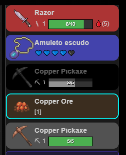
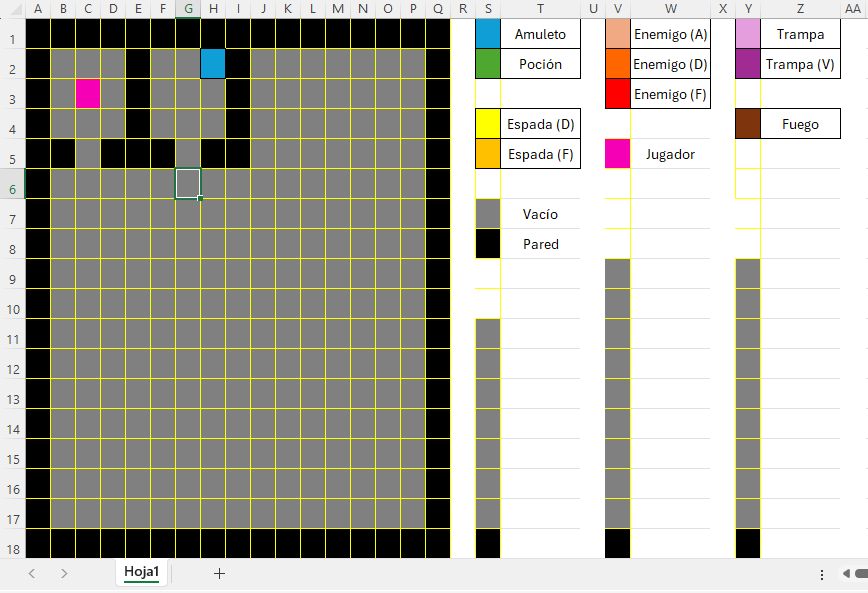

# DevLog - Diario de Combate

## 🔹 Paso 19: Parches necesarios 🚑👩‍💻

🗓️ 2025-01-20

`¿Cómo que no funciona el demo jugable?` 👀

**Resumen**: Refactoricé gran parte de mi código, saqué los errores esLint y mejoré las flags para diferenciar entre local y deploy. La demo funciona otra vez: minar, matar, equipar, DoT- todo al 100%.

[Link al Demo](https://js-dungeon.vercel.app/) 👾✨

Aproveché para ajustar tamaños mínimos y máximos de la consola, el equipo y los consumibles. Agregué el nombre y un hint a que hacen los items para que se expliquen solos- entre otras cosas para emparejar y emprolijar el proyecto.

---

### 🛠️ Cambios técnicos:

-Refactoricé el código para que las flags detecten si están en deploy o localhost.

-Eliminé/corregí todos los warning esLint.

-Consumibles eliminables con 'backspace'.

-Consola/GearTab/ConsumablesTab con max-height cosa que todos entren en orden.

---

### 👾 Futuro próximo / Ideas sueltas 🎯

Siempre me termino encontrando con algo que reparar/optimizar a mitad de camino de mi objetivo real. 😅✨

Ahora que todo está estable, tengo antidotos- minería- combate- curación- drops y todo lo demás podría...

- Darle un uso a los minerales.
- Agregar otro mapa.
- Meter items interactivos. <--

--> Dícese, estaba pensando hacer un ítem (consumible) que sea una `Bomba`💣. Como las de bomberman, que uno deja atras y al rato explota- suena exageradamente sencillo y de paso podría ponerle reglas raras como que:

**`[Se puedan empujar]`** Eso reemplazaría las cajas, que están super olvidadas.

**`[Exploten al contacto]`** Cuando un enemigo las toca explotan, cortar patrullas, preparar emboscadas... 🤤✨

**`[Crear bombas con distintas cualidades]`** Bomba que ***congele***, bomba que ***envenene***, bomba ***incendiaria***...

---

## 🔹 Paso 18: Coherencia visual (user friendly). 🌈👾

🗓️ *2025-01-11*

`Diseño, colores, espacios y bonitura.` ✨

**¡Feliz año nuevo!** 🥳🎉

Okey, mi objetivo principal considerando que ya tengo un 'juego jugable' (Puedo pegar, puedo lootear, puedo farmear...) es tener un **'juego ENTENDIBLE'**.

Quiero que el jugador se siente, avance por el juego y vaya entendiendo sin yo tener que ponerle carteles, tutoriales, guías y textos que le corten la experiencia.

Con eso en mente, agregué mas vida al GearTab encargado de mostrar tu equipo disponible:
- Ícono del objeto visible.
- Colores para distinguir tipos de equipamiento. 
- Cooldown con animación visual.
- Durabilidad visible (barra de vida).

<p align="center">
  
  <br />
  <em>Nuevas visuales para el equipo.</em>
</p>

---

### 🛠️ Cambios técnicos:

Agregué un par de cambios visuales, nada de gameplay- funciones o referencias.

**GearTab.module.css** <- Convertí el css del GearTab en .module para no generar conflictos en caso que escale mas la aplicación.

**Nuevos íconos** y **Nuevo enemigo** <- Agregué nuevos íconos, como el del ore - y un nuevo enemigo, el goblin minero, para que dropée de forma no tan inesperada 'Copper pickaxe'... no tenía mucho sentido que un goblin 'guerrero' dropée un pico de mineria.

**DurabilityBar.tsx** <- Agregué la 'barra de vida' a modo de durabilidad para mayor claridad visual, es mas fácil de entender una barra de vida que un 10/10 y 'usá tu imaginación'.

---

### 👾 Futuro próximo / Ideas sueltas 🎯

Tengo queee... reparar mi intento de inventario- mas bien reposicionarlo- ahora mismo tocando la I se abre toda una interfaz que tengo planeada usar para crafting y demás-- con los items apretados en el fondo.

-Voy a poner los items de inventario siempre visibles en la parte inferior
-¡¡CRAFTING!! Quiero agregar Crafting, darle un uso a los minerales.
- Quizá incluso un sistema de mejoras con joyas o items.

---

## 🔹 Paso 17: Re-definiendo la base.

🗓️ *2025-12-26*

`Mucho debugging, mucho re-thinking.`

Re-definí todo lo que tiene que ver con la lógica base del juego pensando **exclusivamente en escalabilidad**. Cambié avance inmediato por estabilidad futura y, aunque engorroso, era un paso inevitable.

**¡Sorpresa!** *[para mí]*

Mientras reordenaba la base me di cuenta de algo:
para avanzar de verdad no necesitaba un “motor de mapas”… necesitaba una herramienta práctica.

¡Contemplad **JS Map Creator**! 🤓✨

Excel, casillas perfectamente cuadradas, un mapa 18×18, leyendas a un costado y libertad total para experimentar ideas sin pelearme con el código base. Rústico, directo y absurdamente efectivo.

<p align="center">
  
  <br />
  <em>JS Map Creator (Excel-based, 18×18 grid)</em>
</p>

Después pienso traducir manualmente- usando ciclos for y esta referencia clara -fila por fila el mapa para que quede como quiero/necesito.

Como creador solo necesito un fix básico para seguir avanzando, EXCEL tiene lo justo y necesario- del resto me encargo yo. 🎶

---

### 🛠️ Cambios técnicos:

- Cada fila dentro de la matriz ahora representa una entidad completa, no un ícono o dato aislado.
- Las patrullas se manejan de forma individual, permitiendo cortar intervalos específicos *( clearInterval(id) )* sin efectos colaterales ni glitches.
- Bug relacionado con muerte por DoT solucionado.

---

### 👾 Futuro próximo / Ideas sueltas 🎯

Si todo marcha bien y logro mantener el foco, el próximo parche debería cerrar en una **demo jugable real**, con un objetivo claro y gameplay concreto.

...Me muero de ganas por agregar armas a distancia... **magia... ¡AREA DE EFECTO!**. ¡Pero no!. Foco- foco- ¡FOCO! ¡Vamos bien! 👾✨

---

## 🔹 Paso 16: Demo levantada en Vercel 🙂🚀✨

🗓️ *2025-05-26*

`Primer gran paso.`

JS-Dungeon no está terminado, ni yendo totalmente en la dirección que pensaba en un principio- pero eso está perfecto. Mi idea original mutó y evolucionó, yo ya no dirijo la batuta, me dejo guiar por las ideas.

Haber encontrado el tope técnico de `React` no pudiendo manejar ciertas cosas (como multiples layer visuales) me hizo entender que no puedo ***'crear un videojuego complejo'*** acá, pero igual le voy a sacar todo el provecho que pueda. 🔥🔨⚙

Todavía faltan algunas slides de ayuda, explicando por ejemplo DoT- sangrado- veneno- fuego- como usar bien los accesorios o como quitarse los estados, pero no debería seguir pateando para adelante, como si tuviera miedo o verguenza de mi juego- este proyecto es la punta de todo lo que puedo hacer- mientras que me divierto en el proceso

---

### 🛠️ Cambios técnicos:

- DOCS: Actualizado el README.md para tener link directo a la demo levantada en Vercel.
- UI: Agregado cartel de "Apretá H para el tutorial".
- Slide: Agregado slide con botón que redirije al repositorio.

---

### 👾 Futuro próximo / Ideas sueltas 🎯

- ¡Seguimos! Pero ahora, en vivo y desplegados en Vercel. 🚀✨

---

## 🔹 Paso 15: "Press H for HUH?!" ¡Slides de ayuda! 👌🧐✨

🗓️ *2025-05-26*

Estoy cerrando conceptos visuales, redondeando ideas generales y pensando en levantar el proyecto online para que cualquiera pueda probarlo. En este contexto me pregunté: ¿Qué queda **críptico**? ¿Qué NO entendería alguien que entra sin contexto previo?

Con esa mirada crítica sumé un sistema de **slides de ayuda**: presionando la tecla `'H'`, se abre una serie de imágenes que explican lo básico `(HUD, Gear, controles, etc)`. Para hacerlas:
- Busqué, recorté y limpié los fondos de `cada` ícono.
- Diseñé los slides `a mano` (250x350px) con íconos, textos y colores coherentes.
- Organicé todo en una carpeta `Images/`, con su propio `index.ts` para facilitar las importaciones.

También agregué una **pantalla de muerte** (cuando el jugador llega a 0 HP) y reorganicé la interacción con la *hotbar*, que ahora se navega con ↑↓ en vez de ←→ para mantener coherencia con su disposición vertical.

---

### 🛠️ Cambios técnicos:

- **Hotbar**: La navegación pasó de horizontal (←→) a vertical (↑↓), alineándose con el diseño visual.
- **Slides de ayuda**:
  - Lógica de apertura/cierre mediante tecla `'H'`.
  - Estructura de tipos e interfaces para manejar el sistema.
  - Imágenes personalizadas diseñadas a mano y organizadas modularmente.

---

### 👾 Futuro próximo / Ideas sueltas 🎯

- Mostrar información de enemigos al pasar el mouse por encima (vida, daño, armadura).
- Mostrar tooltip con stats de los ítems al hacer hover.
- Crear más mapas con objetivos reales: actualmente el juego es un *sandbox de funciones*. Quiero usar toda esta paleta y crear **algo jugable, con color y sentido**. 🎊✨

---

## 🔹 Paso 14: Massive visual overhaul & modularization 💻🤓🔧

🗓️ *2025-05-24*

**`¡MODULARIZACIÓN!`**

Estaba pensado como mi trump-card, dejar de ser el proyecto de las +2K lineas de código por algo modular y bonito- pero resultó ser inevitable: navegar entre miles de líneas de código desorganizado para mover interfaces, types o íconos era un caos. ¡Hora de la revolución! 💥

Separé archivos específicos para: `types & interfaces`, `entities`, `items`, `gear` e `icons`, mejorando la organización y reutilización del código. Todo correctamente exportado/importado y modularizado. ¡Che bellezza! 🤏

Como el objetivo era avanzar hacia una *demo jugable*, el desorden visual del HUD me hacía demasiado ruído. Este parche se enfocó en corregir el layout, mejorar la coherencia visual y pulir la UX/UI en general.

Manejo de medidas, posiciones absolutas, padding, tamaños de fuente, cards de Gear, logs de consola, estado del jugador... Todo lo necesario para que el juego pase de adivinar que representa ese ASCII a algo más entendible y coherente. 

Además, ahora el daño continuo (DoT) sobre enemigos se ve claramente con valores numéricos. GearCards es más explícito, los ítems tienen hotkeys y muchos otros detalles que, en conjunto, hacen al juego *presentable*... `jugable`. ✨

---

### 🛠️ Cambios técnicos:

- Eliminé scrolls visuales innecesarios y establecí medidas fijas y responsivas para asegurar que todos los elementos encajen correctamente dentro de sus contenedores.
- Se refactorizaron funciones clave (como `setPlayer`, `setEnemies`, etc.) para consolidar actualizaciones y reducir renderizados redundantes, optimizando el rendimiento.
- Se mejoraron detalles visuales: daño visible en enemigos, texto más claro para status effects, hotkeys visibles en ítems (`Item.hotkey: string`), y más.

---

### 👾 Futuro próximo / Ideas sueltas 🎯:

Ahora sí: el proyecto está *presentable*. El siguiente objetivo será redondear un concepto jugable simple, sin añadir nuevas features complejas.

- Evitar agregar nuevas mecánicas pesadas (como patrullas dinámicas, aunque me encantaría) que podrían sobrecargar el motor gráfico basado en React.
- Considerar reemplazar los enemigos actuales por dummys o muñecos de práctica para mantener coherencia ya que- bueno- no se mueven.
- Comenzar la modularización de funciones (hooks personalizados, lógica desacoplada) para continuar limpiando el proyecto a medida que vaya avanzando.

---

🎮 *JS-Dungeon está cada vez más cerca de ser una demo sólida, jugable y con fundamentos técnicos bien plantados.* 👨‍💻✨

---

## 🔹 Paso 13: Amuletos, y un traspié visual. 📿🧐/😨💻

🗓️ *2025-05-20*

¡Bueno! Tuve un pequeño percance 😅 Resulta que me emociono y dibujo en mi cabeza planes a futuro, digamos- **"creo el código de manera escalable"** -es decir que cada nueva pieza agregada está preparada para ampliarse- y extenderse- ¡Y conectarse con sus pares cosa de llegar a la complejidad que mi imaginación quiera! 🤪🎉

**El problema: `REACT`** 🥶💻💥

Nadando en mi cerebro escalable de **dev** tecleando lo que ama, me olvidé que, en la práctica, estoy construyendo una especie de motor visual personalizado desde cero, lo cual excede lo que React puede manejar eficientemente. 😅 ¡Ups!

React no está ni por asomo preparado para tanto re-re-**RE**-renderizado, o manejar tantos estados funcionando a la vez- ni flags- o eventos- ¿¡Animaciones!? Nah React, con sus limitaciones estructurales para animaciones concurrentes, simplemente no está diseñado para este nivel de rendering intensivo.

Por más que amaría terminar con un juego GIGANTE, como diría Howard Stark "Estoy limitado por la tecnología de mi época..." 😁

`¡Mensaje recibido!`: Voy a dejar de implementar/agregar tantas cosas al proyecto y tratar de redondear con lo que tengo para dejar una demo jugable. En todo caso hago un mini-juego de farmeo, otro de combate, otro de.. no se, comercio. Tomé nota de estas ideas para potenciales mini-juegos independientes, pero voy a concentrarme en cerrar una demo jugable primero. ✨

---

### 🛠️ Cambios técnicos:

- ¡Tope técnico! Creé dos capas extra (con toda la lógica) para mostrar animaciones por separado tanto de curación, de daños y visuales en general.

`PERO`... ¿A la hora de testearlo? 💥🔥💥🔥💥

Debugging, testing, refactorizando, tocando y rompiendo dí con el problema. No era viable para el motor que estoy usando- así que tuve que deshacer los cambios y reestructurar la idea, ya que la performance no era viable con la arquitectura actual.

- ¡Amuletos!
`damageCharm();` para manejar el daño a los amuletos, refactorización de `hurtPlayer();` y agregado el ícono de `neckalceImg` entre otras cosas para la funcionalidad completa de amuletos de protección básicos.

---

### 👾 Futuro próximo / Ideas sueltas 🎯:

Ahora que soy consciente del tope técnico:

- Redondear una idea jugable con las herramientas que tengo.
- Algún objetivo en concreto, mostrar `una` rama completa de ALGO: Armas, Estados de efecto, Items, Magias, etc.
- Elegir mis herramientas, descartar las que no estén en sincronía con el objetivo elegido y refactorizar las que sí.

---

## 🔹 Paso 12: ¡Adiós ASCII! Hola mundo entendible ✨😎🤙

🗓️ *2025-05-15*

Estaba avanzando en mecánicas core, refactorización, implementación- y me encontré pensando

"¿Cómo represento esto nuevo?.. ¿Con una `'q'`? ¿Con un `'#'`? ¿Con un...? Perá... ¿Por que sigo usando `ASCII`?"

No puedo avanzar sabiendo que hay algo *"mal"* en mi código, seguir tapando funcionalidades con ASCII era darle más trabajo a mi yo del futuro jajaja así que: ¡`Visual overhaul`!.

Ahora alguien que trate de probar mi juego va a ***teneeeer una idea general*** de que está pasando o que puede hacer. ¡Lo cuál es muchisimo! Puedo mostrar el juego sin tener que estar como voz en *off* explicando que es cada cosa. 🤣👌 

---

### 🛠️ Cambios técnicos:

- **Creación de mapa secundario OVERLAY**: `setVisuals` fue creado para manejar animaciones secundarias, bufos, daños, ataques y demás.
- **Íconos, refactorización y handlers**: Funciones para manejar efectos básicos tanto **sobre** el jugador como en **coordenadas específicas**, íconos .PNG (y su tipado en TS) y refactorización general del código para aceptar estos cambios ( String > ÍCONO ).

---

### 👾 Futuro próximo / Ideas sueltas 🎯:

(Claramente no seguí las ideas sueltas del parche pasado **jajajaj**)

- Ahora que me saqué de encima la espina visual, puedo volver a mecánicas CORE como las planteadas en el parche anterior. Así que **retomando** objetivos pasados.
- Principalmente:
-> HotBar navegable
-> Mas equipables
-> Amuletos, Boosters, ¿Trampas?. //Experimentar\\

---

## 🔹 Paso 11: Equipables, HotBar y durabilidad. 🗡💥✨

🗓️ *2025-05-14*

¡Durabilidad! ¡Equipables! ¡Clásico y obligatorio en un RPG!. Genial, ahora el jugador puede `equiparse` las armas que vaya encontrando, cambiando sus estadísticas a la hora de golpear enemigos ( Daño directo y DoT ).

Los enemigos tienen distinta `dureza` (Toughness) que se traduce en daño a la durabilidad del arma, una vez esta llega a **cero** se **`ROMPE`**. Nada de "ah, si llega a cero la reparo" nonono- **Cero = PERDIDA del arma** 😈.

Las armas aplican *`estados alterados`* en los enemigos (Veneno, Sangrado, Quemadura) tal y como se aplican a los jugadores. Planeo poner el tema de inmunidad a ciertos estados o resistencia a estos en próximos parches, consideré mas importante dejar la **BASE** sólida en este parche estable antes de incursionar en colores y detalles lindos como ese. ( % de chances de aplicar ciertos DoT según resistencias de las criaturas, inmunidad = 0% de chances de aplicar  el estado )

El jugador tiene un feed visual inmediato en la consola de eventos cuando daña un enemigo, si le aplica estados alterados o si mató a la criatura. Colores, mensajes y prevención de doble-render (mas otros bugs cortesía de React y sus scope issues/asincronía) fueron añadidos para robustez y escalabilidad del código.

---

### 🛠️ Cambios técnicos:

- **Refactorización**: `damageEnemy();`, `enemyDeath();`, `manageDotInstance();` y `cleanse();` fueron modificadas para utilizar la misma lógica de DoT, cleanse y muerte.

- **Limpieza de bugs**: `manageDotInstance();` y `finishDoT();` fueron refactorizados para consumir **siempre** de la última versión disponible de datos y actualizar correctamente la información. Encontré puntos débiles en el código que no eran un problema presente pero a futuro podían traer complicaciones.

---

### 👾 Futuro próximo / Ideas sueltas 🎯:

- Ahora que tengo DoT en los enemigos, lo próximo es trabajar **resistencias**- **inmunidades**... ¿Quizá incluso **AoE**? 💥🔥😱

- Manejar de manera mas 'realista' los DoT- digamos que el daño de mi arma no pasa la armadura del enemigo (Armadura 1, daño de mi arma 1 = daño que entró **0**)- en este caso- no tendría sentido que la criatura termine **envenenada** o **sangrando**. ¡No hubo contacto físico! jajaj En caaaso de que por lo menos lo toquemos por **1** de daño ->*tendría sentido* que termine envenenado, no se si tanto como para **SANGRANDO** pero envenenado sí. Quizá poner un threshold de "Si el arma mete sangrado y le pegué por lo menos **[tanto]** = sangrado" o alguna cosita así. Tipo, la **[Quemadura]** tendría sentido que le entre sin contacto físico- jugar con esos límites. ✨🐱‍💻✨

- Aprovechando que este parche fue sobre Gear equipable y HotBar, podría ahondar en el asunto (preparandome para los próximo en mi lista de deseos) haciendo que no sea instantaneo el cambio de equipo, que uno pueda *`navegar`* por los items equipables, pararse sobre lo que uno quiere equipar/desequipar y con un botón **hacerlo** (como en Monster Hunter, navegar, quedarse sobre el ítem deseado, "usar").

🗡  - 🔪  - `(🪒)`

🗡  - `(🔪)`  - 🪒

`(🗡)`  - 🔪  - 🪒

- Si logro aplicar el HotBar seleccionable, agregar otro tipo de **`Gear equipable`**. Amuletos, escudos, no se, *`boosters`* de daño que duren por x golpes- **tantas posibilidades** gracias a la escalabilidad. ✨🐱‍💻💕

---

## 🔹 Paso 10: Sistema de farmeo y drops implementado 🌾🪓🧱

🗓️ *2025-05-07*

Con este parche queda implementada la versión inicial del sistema de farmeo. Los enemigos ahora pueden morir y dropear ítems, y esta misma lógica se generaliza para otras entidades interactivas del juego.

Cualquier entidad destruible —como vetas de mineral, árboles, puertas, cajas, puentes o paredes ocultas— puede activar un evento de drop al ser "destruida". Esta estructura permite escalar fácilmente hacia nuevas mecánicas de recolección y exploración.

El sistema de movimiento y patrullaje de enemigos fue pospuesto para una futura iteración, una vez que el prototipo jugable alcance un estado más presentable.

---

### 🛠️ Cambios técnicos:

- **`finishBuff()`**: Finaliza un efecto activo del jugador, eliminando todos los intervalos asociados (HoT, buffs, escudos, etc.).
- **`handleInteraction()`**: Gestiona la acción de interacción. Al presionar `[ENTER]`, ejecuta la acción contextual sobre la entidad frente al jugador.
- **`damageEnemy()`**: Recibe las coordenadas del enemigo y el daño infligido. Aplica daño considerando defensas y escudos, y en caso de muerte, ejecuta la lógica de drop según su `dropTable`.
- **Interfaces y tipos personalizados**: Se definieron estructuras específicas para enemigos, trampas e ítems. Esto permite que al detectar una entidad en el mapa, el sistema devuelva el objeto completo correspondiente (con stats, comportamiento y propiedades), facilitando el flujo general del juego.

---

### 👾 Futuro próximo / Ideas sueltas 🎯:

- Algo que tenga que ver con equipo en sí. Ahora mismo, [ENTER] "ataca" lo que tenga el jugador delante suyo por `2` de daño. ¿Por qué 2 de daño? ¿Le está pegando con las manos?. Fácil, agregar armas con daño- durabilidad- eh- quizá efectos de estado.
- Lo de efectos de estado también abre la ventana a aplicarle estos a enemigos, no solo que el jugador se pueda envenenar y demás.
- Equipar item, perder durabilidad de las armas, al llegar a cero romperlas (No que quede en 0/100 como en otros juegos. Que se ROMPA.)
- Lo cual *(jejejejeje)* me da otra idea, mejorar items- +1, +2, joyas- 'encantamientos' aaah- **tantas ideas locas**. 

---

## 🔹 Paso 9: Refactorización, centralización, orden y coherencia. ☝🤓✨

🗓️ *2025-04-30*

Refactoricé GRAN parte de la lógica `CORE` del proyecto. Habían demasiados estados locales independientes uno del otro pero a la vez compartiendo la misma función: **Modificar valores correspondientes al jugador.** Eso decía "REFACTORIZAME POR FAVOR" por todos lados, así que accedí a sus demandas. 

Residual, ticks de daño DoT, inventario, flags, **TODO** refactorizado línea por línea, como desarmando un reloj para ver por qué gira... y rearmándolo para que gire aún mejor. Fue un lindo baile, ahora siento que puedo caminar en el código sin tropezarme con un ejercito de estados independientes quizá rompiendose por **acá**- quizá rompiendose por **allá**.

Además de tratar de romperlo a cada rato a ver si aguantaba, cosa que hace, en medio de la inspiración refactorizadora (?) me encontré teniendo varias ideas para implementar -PERO NO- Resistí la tentación de mezclar objetivos y meter cambios que no entraban en el objetivo general de este sprint: Refactorizar y ordenar. Así que ahí vá- todo refactorizado para encajar en el estado local player (.Aliments, .HP, .HpMax, .Data, etc.). 

---

### 🛠️ A nivel técnico:

- `residual()` refactorizado para poder albergar muchos símbolos a la cola de espera para reaparecer.
- Lógica detras de `DoT` y `cleanse()` re-pensados para encajar con el nuevo modelo mas escalable girando entorno a Player.
- Inventario, HP, coordenadas de usuario- todo lo que tenga que ver con la instancia "jugador" fue centralizado en un solo objeto (estado local).

---

### 👾 Futuro próximo / Ideas sueltas 🎯:

- Tengo que meter el concepto de corta-curas urgente o me va a estallar una vena creativa jajaja 😂✨
- Enemigos que se muevan, primeramente.
- Enemigos que lastimen al jugador al chocarlo.
- Enemigos que reciban daño y puedan morir.

Si me sobra tiempo:

- Que el jugador tenga alguna clase de ataque.
- DROP RATES [¿ALPHA?]

---

## 🔹 Paso 8: Bases del inventario, consumir y recoger ítems 🎁💰✨

🗓️ *2025-04-26*

El paso anterior siempre me deja una ruta clara para el siguiente feature. Como ya creé sistemas de Curación y Cleanse de estados (sangrados y efectos), el siguiente paso lógico era permitir una interacción más estratégica con estos recursos: **inventario y hotkeys**. 💰✨

Ahora `el jugador puede encontrar ítems tirados en el piso` y, al pisarlos (si tiene espacio en el inventario), `los recoge` automáticamente, apilándolos. También puede `consumirlos`, respetando el conteo de existencias y un sistema de *cooldown* que evita el uso indiscriminado (¡nada de "cura, cura, cura" como estrategia! 😄).

Refactoricé toda la lógica pertinente para asegurar que los cambios sean **escalables y estables** a futuro. El mundo ahora puede dañarnos, y tenemos formas de contrarrestarlo: manejo de recursos, farmeo de ítems, enemigos que podrán dropear loot... **¡Se abren muchas posibilidades!**

---

### 🛠️ A nivel técnico:

A nivel de implementación, los principales métodos nuevos son:

- `stepOnItem()`: Verifica si hay espacio en el inventario y, de ser así, llama a `addToInventory()` para gestionar la recolección.
- `addToInventory()`: Maneja el almacenamiento de objetos, stacking de ítems y control de cantidades.
- `consumeItem()`: Se encarga de consumir ítems, validando requisitos de consumo y gestionando el cooldown posterior.
- Sistema de **Cooldown** agregado.
- Tipado explícito de objetos y funciones para garantizar consistencia y claridad futura.
- Introducción de hotkeys para consumo rápido.

---

### 👾 Futuro próximo / Ideas sueltas 🎯:

Antes de seguir sumando nuevas funcionalidades, priorizaré una **etapa de refactorización profunda**. Aunque me encantaría seguir creando features sin freno, es importante ser mi propio Team Leader y garantizar que la base de código sea sólida, limpia y escalable.

Si me llegara a sobrar tiempo después de refactorizar, planeo avanzar en:

- Crear enemigos que patrullen áreas, con lógica de colisión con el entorno.
- Integrar sistemas de interacción entre patrullas, jugadores, obstáculos y objetos del mundo.
- Implementar **Drop Rates** para ítems, abriendo la puerta al loot farming.

---

### 🔹 Paso 7: Cleanse, curación, "totems".
_🩺 ¡Ayudas! 💉_

🗓️ *2025-04-25*

Habiendo implementado el DoT en el parche pasado, lo más equilibrado para cerrar el ciclo es implementar lo opuesto. Curas, limpieza de estados alterados, Healing Over Time (**HoT**). Y eso es justamente lo que hice.

La `curación` y el **HoT** fueron mas sencillos de crear- tuve que refactorizar la función opuesta (hurtPlayer) para DAR vida en lugar de quitarla, mismo que el HoT- refactorizar DoT pero al revez.

Ahora el `Cleanse();`, fue un desafío un poco mas rebuscado. Tuve que guardar los.. bueno, detalles técnicos aparte- tuve que repensar como guardaba, aplicaba y seguía todos los daños para poder cancelar eficientemente todo. **Hermoso**, amo los desafíos lógicos.

Ahora tengo un mundo que puede equilibrarse solo: Dañar y curar- afectar y limpiar, poder tomar riesgos calculados sabiendo tomar contramedidas. *Complejidad*, ahhh- Herramientas para mañana.

---

**🛠️ A nivel técnico:**

- Creación de `cleanse()`: Recibe que estado, sino todos, deseas quitar- cancelando todo el daño que te faltaba recibir.
- useEffects y funciones relevantes refactorizadas para adaptarse al cambio.
- 'Totems' y hotKeys para limpiarse efectos negativos y curarse implementados.

---

**👾 Futuro próximo / Ideas sueltas 🎯:**

Mhmmh... Ahora que tengo Curaciones y Cleanse, podría incursionar en como equilibrar esto.
- Corta-Curaciones: Enemigos, totems, areas, trampas, algo que haga que el `heal();` activo se **DETENGA**.
- CD para curaciones: No poder darle al botón como metralleta para curarse infinitamente. Tampoco tirarse clean cada dos segundos, etc.
- IN-VEN-TA-RIO: ¿Curarse? ¿Parar sangrado?... ¿Quitar veneno? Suena a que solo podrías hacer eso con... ***el item correspondiente en el inventario***. 😈

---

### 🔹 Paso 6: StatusEffect, el inicio de los buff/debuffs. 😷✨💪 

🗓️ *2025-04-24*

Después de estancarme un poco con el tema de los corazones, la visual, lo responsive, asincronías de useState(); y dos o tres shutdowns porque *no soy exactamente *FANÁTICO* de crear detalles visuales* (👀🔪) me encontré escapando a un poco de **lógica pura y dura**. `StatusEffect` 👌💕

Cada nuevo DoT agrega un tick a la cola de estados alterados- pueden stackear todo lo que quieran y los metí en un label para darle mas estilo (barra de buffos) clásica de RPG.
```
StatusEffect: [Burning 🔥] [Bleeding🩸] [Poisoned💚]
HP: 💖💖💖💖💖🖤
```
Un paso en la dirección que originalmente apunté en el anterior devlog.md, pero que no es **exactamente** a lo que apunté en el anterior devlog.md por razones técnicas y de eficiencia. 

``Nota al pie:`` Intenté rushear un sistema de `cleanse()` pero aunque no me da el tiempo jajaja ya tengo una idea de como implementarlo en el siguiente parche. 🐱‍💻👾

---

**🛠️ A nivel técnico:**

- Refactorizado `hurtPlayer()` para seguir los ticks de DoT y sus finalizaciones.
- Agregado label que refleje los estados alterados actuales (acumulados) activos.
- Implementado sistema de ticks (cola) y estados (boolean) para saber que estado está activo y por cuanto tiempo más.

---

**👾 Futuro próximo / Ideas sueltas 🎯:**

- `Cleanse();` Obviamente 😎🐱‍💻´
- `Healing();` Alguna manera super [BETA] de curar al personaje.
- `Buffs`: Quizá meter un escudito, bufito de algún tipo- para aprovechar el statusEffect.

---

### 🔹 Paso 5: Sistema de Daño por Tiempo (DoT)
_Tantas maneras de causar DOLOR_ 😈🔥

🗓️ *2025-04-23*

***¡Ahhhhh!...*** Al fin llegó el primer golpazo de dopamina real jajaj. Ver cómo el HP seguía bajando después del golpe fue... `perfecto 👨‍💻💕`.

Con las funciones de DoT ahora refactorizadas y pensadas para escalar me siento como un nene al que le dieron un balde, una palita y lo dejaron en la playa 🧨✨.

```¡Tanto RAW MATERIAL con el que Jugar!```

---

**🛠️ A nivel técnico:**

- Refactorizada la función de daño `hurtPlayer()` para aplicar DoT al jugador. 🩸💀
- Agregada función `stepOntoFire()`: El fuego ahora daña, empuja y bloquea el paso. 🔥🚫
- Refactorizado `touchEnemy()` y `stepOnTrap()` para diferenciar tipos de enemigos y tipos de daño. ⚔🗡

---

**👾 Futuro próximo / Ideas sueltas 🎯:**

Quiero frenar un poco para pulir detalles visuales antes de seguir avanzando.

### 📌  Indicadores visuales en los corazones según el tipo de daño pendiente (DoT):

- 💖 [ Sano ]
- 💚 [ Envenenado ]
- 💔 [ Sangrando ] 
- 🖤 [ Vida perdida ]

Ejemplo: si tenés 5 corazones y te aplican 2 de veneno:

- 💖💖💖💚💚
- 💖💖💖💚🖤
- 💖💖💖🖤🖤

Y si se combinan distintos estados:

- 💖💔💔💚💚
- 💖💔💚🖤🖤
- 💖🖤🖤🖤🖤

Esto suma **claridad visual**, **urgencia estratégica** y un plus de **inmersión** 🧠💡. Si ves [💔💚💚💚💚], sabés que curar el veneno es prioridad máxima.

### 🎨 Junto con otros update visuales que vaya encontrando. ✨
- Enemigos ( F por 🔥 );
- Trampas ( 't' por 🔳, 'p' por 🔲 );
- Ambiente ( T por 🌀, B por 🟦)

---

### 🔹 Paso 4: "Enemigos", placas trampa y lógica vidas/muerte. 💖💖🖤🖤

🗓️ *2025-04-22*

Mundo estático, quieto, vacío, ``sin peligros``. Eso es lo que estuve creando hasta ahora. Podría haber seguido para el lado temático o de interacciones con el mundo per-sé, pero preferí darle peligro- empezar a pensar antes de mandarse corriendo... darle `CONSECUENCIAS` 💀🗡.

**Enemigos**: Por más que sean un 'totem' mirandote feo- **ESTÁN AHÍ**, bloqueandote, *pegándote*, forzándote a cambiar de ruta.

**¡Placas trampa!**: Ahora mismo, se ven, porque -obvio- estilo ASCII 💽 Pero cuando el mapa evolucione podría, no se, hacerlas invisibles- o 'deducibles', tipo: en esta parte del camino no hay vegetación, normalmente aparecen trampas random en zonas así- mejor evito. ¡Lore! ¡Preparación! ¡Conocimiento! ¿Y si no? `¡Consecuencias!`.

Básicamente eso es este paso, como todo lo anterior y todo lo que va a venir es el primer pincelazo apuntando hacia-algo. Hacia→ mas mecánicas. Hacia→ nuevas interacciones. Hacia→ un mundo que reaccione, cambie y cobre vida con cada línea que agrego.

---

**🛠️ A nivel técnico:**
- Funciones `touchEnemy()`, `stepOnTrap()` y `hurtPlayer()` agregadas.
- Refactorización del sistema `residual`, haciendolo mas legible y escalable.
- Eliminé `isAtSpecialTile()`: Al buscar siempre la manera más eficiente de escribir mi código, me dí cuenta que podía quitar toda esta función y reemplazarla por un &&. Lo bello de vivir tratando de romper tu propio código. ♪ ♫

---

**👾 Futuro próximo / Ideas sueltas 🎯:**

🤔 Mhmmh... ya sé, ahora que tengo **placas trampa** y **enemigos** que hacen daño **`DIRECTO`**... 😈

- 🔥 Fuego (Daño por quemadura), 💚 Trampas venenosas (Daño por veneno), 🩸 Enemigos con armas cortantes (Daño por sangrado).

*Agregar los primeros `DOT` (Damage Over Time) y su lógica suena al próximo paso lógico- y **lógico** me emociona porque suena divertido. 🐱‍💻👾*

- Quizá incursionar en un enemigo que... ¡¿se **MUEVA**?! 😨⚡.

---

### 🔹 Paso 3: TPEAR CAJAS, BLOQUEAR PORTALES.

1. 👉📦🌀 ~~~~~~ 🌀 [habilitado]
2. 👉🌀❌ ~~~~~~ 📦 [bloqueado]

🗓️ *2025-04-21*

Primera pensada real que tuve que hacer en el proyecto. Hubo un par de bugs, un par de "¿Eh?... Ahhh".
Empieza a tomar forma, aunque **obviamente** está en SUPER pañales todo.

Los `Teleporters` aceptan transportar cajas ahora, pero el TP queda **bloqueado** hasta que saques la caja del otro lado, junto con toda la lógica interna y un `residual` que queda esperando a que el jugador libere el camino para volver a funcionar.

Esta adición me abrió los ojos a futuras optimizaciones, refactorizaciones y temas de escalabilidad que el proyecto va a necesitar sí o sí.
Divertido, satisfactorio. El progreso se siente placentero ♪

---

**🛠️ A nivel técnico:**
- Se creó la función `isAtSpecialTile` para detectar si el jugador está parado sobre un tile especial (TP, trampa, fuego, etc.), importante para el sistema de `residual`.
- Se refactorizó `handleTp` para permitir tpear tanto al jugador como a cualquier otro objeto (enemigos, flechas, bombas, etc. 😈).
- Se agregó el case `'teleport'` dentro de `pushBox()` para incluir esta nueva posibilidad.

---

**👾 Futuro próximo / Ideas sueltas 🎯:**
- Debería... **debería** empezar a optimizar mi código, o en unos 6–7 parches va a ser un cableado injunable y poco disfrutable de trabajar.
- TP de cajas y bloqueo: LISTO ✅
  ¿Siguiente? Si agrego fuego, enemigos o trampas, voy a tener que meter el factor `HP`. Mhmmh... Ya sé.
- Sistema de **vidas**: 3 hits. ¿Cae a 0? GAME OVER → Se bloquea el juego, se resetea el mapa y arranca la partida de nuevo.
- Pulirlo bonito y crear un enemigo estático que al tocarlo quite una vida y empuje un casillero para atrás—algo simple por ahora.

---

### 🔹 Paso 2: TELEPORT 👉🌀 `~~~~~~` 🌀👉
🗓️ *2025-04-20*

Tras mi primera victoria en forma de cajas, sentí la necesidad de implementar algo más "divertido" como siguiente meta —o iba a terminar mandando CVs a McDonald's (¿?).

`Teletransportarse` es una de esas mecánicas que pueden agregar muchísima complejidad: interacciones, lógica oculta, mecánicas avanzadas y más cositas. Así que decidí crear la **base funcional** de la misma y dejarla quietita en este push, para poder adelante hacerla `*explotar por los aires*` con experimentos locos y delirios místicos sin miedo a quedar en la lona 💥.

(Traducción: voy a testear/romper todo hasta que quede algo copado, o tenga que volver a esta versión en plan "retirada estratégica").

**🛠️ A nivel técnico**:
- Se creó la función `handleTp` con la lógica principal de teletransportación.
- Se introdujo el estado `residual` para recordar qué tile había bajo el jugador antes de moverse, y restaurarlo al abandonar la casilla.
- Se refactorizó `movePlayer` para integrar esta nueva lógica sin romper otras colisiones.

**👾 Futuro próximo / Ideas sueltas 🎯**:
- Permitir que las cajas (`B`) pasen por teletransportadores (`T`). *(Combinación de mecánicas anteriores)*
- Bloquear `T` con una `B`, abriendo camino a mecánicas estratégicas (bloquear enemigos, trampas, emboscadas).
- Usar `residual` para empezar a experimentar con tiles peligrosos (🔥fuego, 💀trampas, 🩸estados negativos).

---

### 🔹 Paso 1: CAJAS 👉📦
🗓️ *2025-04-20*

Terminé con la lógica para que el personaje se mueva, que no pueda caminar más allá de los límites del mundo *y* que se detenga antes de dársela contra una pared (ojalá yo tuviera ese script, vivo llevándome cosas por delante).

Con el patio de juegos limpio y muchas ideas alborotándose en mi cabeza, decidí arrancar por algo simple: colisionar con un objeto movible y sus posibles consecuencias (bloquear salidas, pisar cosas, apretar botones, tapar pozos — *UFF, ideas, ¡IDEAS!*).

**🛠️ A nivel técnico**:
- Se creó la función `checkCollision()` para determinar con qué tile se encuentra el jugador al intentar moverse.
- Se implementó `pushBox()` con la lógica de empuje condicional (requiere espacio libre).
- Se introdujo la función `inconsecuente()` para movimientos sin efecto, evitando duplicar lógica innecesaria en múltiples ramas condicionales.
- Se refactorizó código general para modularizar mejor comportamientos repetitivos y simplificar el flujo de `movePlayer()`.

**👾 Futuro próximo / Ideas sueltas 🎯**:
- Agregar teleports (`T`) para que el jugador pase de punto A al punto B de inmediato.
- Agregar puertas (`D`) y su lógica base (Activada = pasa, Desactivada = `inconsecuente()`).
- Crear interruptores (`S`) básicos (Activar/Desactivar algo cercano).
- Crear interacción entre *cajas* y *teleports* (bloquear, activar).

---